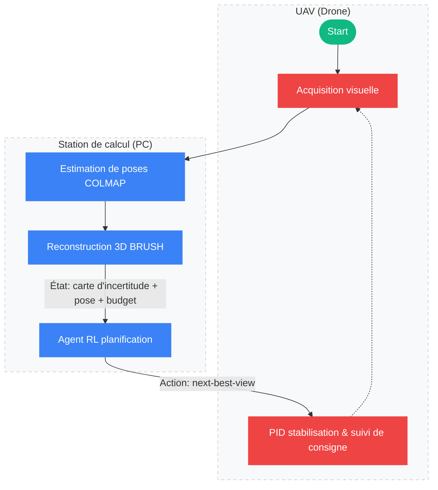

<figure style="text-align: center;">
    
    <figcaption><i>Une caméra 360°, un drone, et un peu d'optimisation... probablement.</i></figcaption>
</figure>

Ce nouveau projet vise à optimiser la trajectoire de vol d’un drone via l'[Apprentissage par Renforcement (RL)](https://fr.wikipedia.org/wiki/Apprentissage_par_renforcement) afin d'améliorer la qualité et la vitesse d'une reconstruction 3D basée sur le [3D Gaussian Splatting (3DGS)](https://repo-sam.inria.fr/fungraph/3d-gaussian-splatting/).

L'idée centrale repose sur l'efficacité : au lieu de scanner naïvement une zone entière, le drone utilise un signal d’incertitude fourni par le modèle pour cibler les zones mal reconstruites. C'est le principe de la planification du prochain meilleur point de vue (Next-Best-View Planning). L’objectif est de maximiser le gain d'information tout en minimisant le temps de vol.

**Objectif :** Tester le 3DGS pour obtenir une vision claire des contraintes et de la faisabilité du projet. Il est à noter que le choix de la stack technique (RL & 3DGS) est avant tout dicté par mes intérêts personnels et une volonté d'apprentissage.

---

## Architecture du Pipeline

Pour atteindre cette autonomie, le système repose sur une architecture en boucle fermée où le traitement lourd est déporté sur une station de calcul fixe. Voici l’architecture *Perception-Action* envisagée :

Le pipeline débute par l'acquisition des flux vidéo et inertiels, lesquels alimentent une reconstruction 3DGS incrémentale. L'**analyse d'incertitude** est ici le pivot : en identifiant les zones où la densité des gaussiennes est faible ou les gradients de couleur instables, l'agent RL peut déterminer mathématiquement le prochain point de vue optimal (Next-Best-View) pour "remplir les trous". Dans le cas où les temps de calcul sont trop longs, on peut envisager de faire atterrir le drone en attendant que la reconstruction soit terminée, cela va dépendre de la batterie du drone et des temps de calcul requis.

---

## Analyse des premières expérimentations

La faisabilité d'un pilotage autonome repose sur la fluidité de la chaîne de traitement. Cette phase d'expérimentation vise donc à mesurer les performances brutes de la reconstruction afin de déterminer si les temps de calcul sont compatibles avec les exigences d'un vol drone, préalable indispensable à toute tentative de RL.

Une première référence a été établie via une approche mobile (Scaniverse / SuperSplat) sur un sujet simple :

  <a href="/scans/panda-roux.html" class="scan-card">
    
Vidéo

    <h3>Scan Panda roux</h3>
  </a>

Si cette méthode est rapide et efficace, elle reste une "boîte noire" dépendante d'optimisations propriétaires et d'un traitement local optimisé (exploitant notamment l'IMU des smartphones), ce qui la rend difficilement transposable telle quelle à un système embarqué drone.

Pour me rapprocher des conditions d'un drone porteur d'une optique de qualité, j'ai réalisé une série de tests avec un Fujifilm XT-2 (23mm f/2). Le traitement, effectué sur une station fixe (RX 7800XT), a immédiatement mis en évidence la lourdeur du calcul [Structure-from-Motion (SfM)](https://en.wikipedia.org/wiki/Structure_from_motion). Qu'il s'agisse d'un matching exhaustif sur photos (environ 10 minutes pour 30 clichés) ou d'un matching séquentiel sur flux vidéo (environ 5 minutes), les temps de calcul restent incompatibles avec une boucle de contrôle réactive. 

Ces essais avec le XT-2 ont également souligné des limites physiques critiques. La focale de 23mm (eq. 35mm) s'est avérée être en limite basse pour la reconstruction d'objets isolés, captant un volume d'environnement inutile qui surcharge le calcul de matching. Plus problématique encore : l'absence de stabilisation (IBIS) sur le boîtier et l'objectif génère un flou de bougé qui dégrade instantanément la qualité des gaussiennes, confirmant les points de vigilance soulevés dans ce [Guide sur la prise de vue pour le 3DGS](https://developer.playcanvas.com/user-manual/gaussian-splatting/creating/taking-photos/#:~:text=Taking%20Photos-,Taking%20Photos,-The%20quality%20of).

  <a href="/scans/zigoto.html" class="scan-card">
    
Vidéo

    <h3>Scan Zigoto</h3>
  </a>
  <a href="/scans/fuji.html" class="scan-card">
    
Vidéo

    <h3>Scan Bibliothèque</h3>
  </a>

Le passage à l'échelle sur un appartement complet a soulevé des questions techniques importantes, notamment sur la stabilité du pipeline COLMAP sur ma configuration (RX 7800XT). 

> Bien que le GPU soit nativement compatible via ROCm/OpenCL, les crashs systématiques rencontrés sous WSL2 semblent davantage liés aux couches d'abstraction de la virtualisation ou à des conflits de pilotes qu'aux limites matérielles de la carte.
{: .alert-caution }

S'il est possible de basculer les calculs sur le CPU, les temps de traitement deviennent prohibitifs. Ce constat renforce l'idée qu'un pivot vers une approche moins dépendante du SfM classique est une piste sérieuse à explorer pour fiabiliser le pipeline de développement.

De plus, ce test sur une scène plus vaste m'a fait réaliser qu'il est facile d'oublier certains angles de vue critiques. Ces lacunes se traduisent directement par l'apparition d'artefacts ou de zones de mauvaise reconstruction dans le splat final. 

---

## Pistes d'optimisation : L'alternative au SfM classique
L'analyse des premiers tests indique que le verrou technologique ne se situe pas dans l'entraînement des gaussiennes, mais dans l'estimation de pose (SfM). Comme le souligne une discussion sur [Reddit](https://www.reddit.com/r/GaussianSplatting/comments/1mdjscn/how_is_the_scaniverse_app_even_possible/) concernant l'efficacité d'applications comme Scaniverse, l'astuce réside dans l'utilisation des données capteurs : en exploitant l'ordre des images et les données gyroscopiques, il est possible de s'affranchir de la majeure partie des calculs de structure.

Le drone disposant par définition de capteurs précis (IMU, odométrie, GPS), la stratégie consiste à initialiser les poses via la télémétrie ou à utiliser un SLAM visuel embarqué pour remplacer le pipeline COLMAP. Cette approche permettrait de fournir des poses "suffisamment bonnes" pour que l'optimisation 3DGS prenne le relais, sans passer par un matching exhaustif coûteux. 

### Solutions techniques à l'étude

Plusieurs alternatives *SfM-Free* ou architectures optimisées ont retenu mon attention pour pallier les limitations de COLMAP.

* [GLOMAP](https://github.com/colmap/glomap) : Ce nouveau moteur de mapping global se présente comme une alternative moderne à COLMAP, promettant une accélération significative du processus de reconstruction. Son évaluation est actuellement en suspens à cause d'un [bug connu](https://github.com/colmap/glomap/issues/221). De plus, il reste dépendant de COLMAP pour les étapes préalables d'extraction et de matching des points d'intérêt (*features*).

* [CF-3DGS (COLMAP-Free 3DGS)](https://github.com/NVlabs/CF-3DGS) : Une piste que je souhaite évaluer pour s'affranchir totalement de la triangulation initiale lourde en apprenant conjointement les poses et la géométrie. Cependant, il s'agit d'un code de recherche non maintenu.

---

## La suite
Maintenant que les verrous logiciels et les limites du SfM classique sont identifiés, il est temps de passer au hardware et à la simulation.

[Lire la Partie 2 : Le choix du drone et l'environnement RL]()