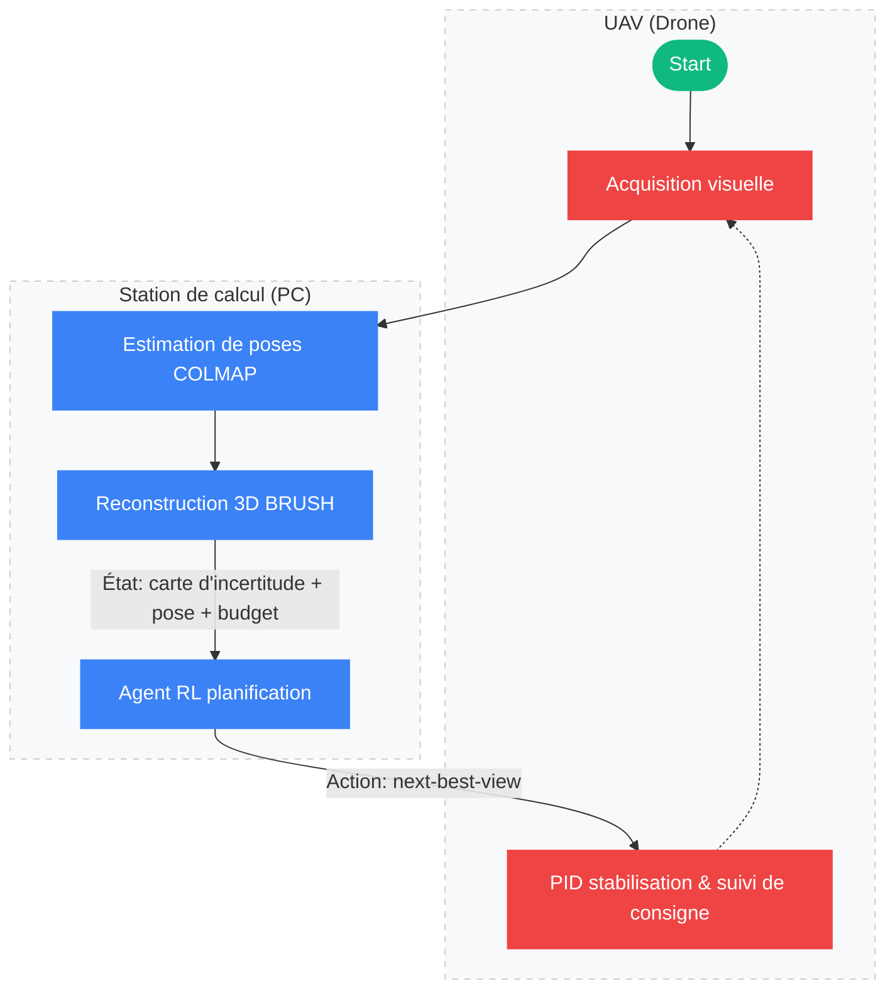

<figure style="text-align: center;">
    
    <figcaption><i>Je fixe une caméra 360° sur un drone, probablement.</i></figcaption>
</figure>

Ce nouveau projet vise à optimiser la trajectoire de vol d’un drone via l'[Apprentissage par Renforcement (RL)](https://fr.wikipedia.org/wiki/Apprentissage_par_renforcement) afin d'améliorer la qualité et la vitesse d'une reconstruction 3D basée sur le [3D Gaussian Splatting (3DGS)](https://repo-sam.inria.fr/fungraph/3d-gaussian-splatting/).

L'idée centrale repose sur l'efficacité : au lieu de scanner naïvement une zone entière, le drone utilise un signal d’incertitude fourni par le modèle pour cibler les zones mal reconstruites. C'est le principe de la planification du prochain meilleur point de vue (Next-Best-View Planning). L’objectif est de maximiser le gain d'information tout en minimisant le temps de vol.

**Objectif :** Tester le 3DGS pour obtenir une vision claire des contraintes et de la faisabilité du projet. Il est à noter que le choix de la stack technique (RL & 3DGS) est avant tout dicté par mes intérêts personnels et une volonté d'apprentissage.

---

## Architecture du Pipeline

Pour atteindre cette autonomie, le système repose sur une architecture en boucle fermée où le traitement lourd est déporté sur une station de calcul fixe. Voici l’architecture *Perception-Action* envisagée :

Le pipeline débute par l'acquisition des flux vidéo et inertiels, lesquels alimentent une reconstruction 3DGS incrémentale. L'**analyse d'incertitude** est ici le pivot : en identifiant les zones où la densité des gaussiennes est faible ou les gradients de couleur instables, l'agent peut déterminer le prochain point de vue optimal (Next-Best-View) pour "remplir les trous". Dans le cas où les temps de calcul sont trop longs, on peut envisager de faire atterrir le drone en attendant que la reconstruction soit terminée, cela va dépendre de la batterie du drone et des temps de calcul requis.

---

## Analyse des premières expérimentations

La faisabilité d'un pilotage autonome repose sur la fluidité de la chaîne de traitement. Cette phase d'expérimentation vise donc à mesurer les performances brutes de la reconstruction afin de déterminer si les temps de calcul sont compatibles avec les exigences d'un vol drone.

Une première référence a été établie via une approche mobile (Scaniverse / SuperSplat) sur un sujet simple :

  <a href="/scans/panda-roux.html" class="scan-card">
    
Vidéo

    <h3>Scan Panda roux</h3>
  </a>

> Pour une meilleure manipulation du sujet dans le viewer, un double-clic dessus permet de tourner autour.
{: .alert-info}

Si cette méthode est rapide et efficace, elle reste une "boîte noire" dépendante d'optimisations propriétaires et d'un traitement local optimisé, ce qui la rend difficilement transposable telle quelle à un système embarqué drone.

Pour me rapprocher des conditions d'un drone porteur d'une optique de qualité, j'ai réalisé une série de tests avec un Fujifilm XT-2 (23mm f/2). Le traitement, effectué sur une station fixe (RX 7800XT), a immédiatement mis en évidence la lourdeur du calcul [Structure-from-Motion (SfM)](https://en.wikipedia.org/wiki/Structure_from_motion). Qu'il s'agisse d'un matching exhaustif sur photos (environ 10 minutes pour 30 clichés) ou d'un matching séquentiel sur flux vidéo (environ 5 minutes), les temps de calcul restent incompatibles with une boucle de contrôle réactive. 

Ces essais avec le XT-2 ont également souligné certaines contraintes matérielles. Si la focale de 23mm (eq. 35mm) est en réalité un avantage pour le SfM formel (le grand-angle maximisant le recouvrement entre images), elle complique la reconstruction d'un sujet isolé s'il n'est pas proprement masqué (via segmentation ou *bounding box* ajustée), surchargeant alors inutilement le calcul de *matching*. Plus problématique encore : l'absence de stabilisation (IBIS) sur le boîtier et l'objectif nécessite des vitesses d'obturation très rapides pour éviter le flou de bougé qui dégrade instantanément la qualité des gaussiennes, confirmant les points de vigilance soulevés dans ce [Guide sur la prise de vue pour le 3DGS](https://developer.playcanvas.com/user-manual/gaussian-splatting/creating/taking-photos/#:~:text=Taking%20Photos-,Taking%20Photos,-The%20quality%20of). 

  <a href="/scans/zigoto.html" class="scan-card">
    
Vidéo

    <h3>Scan Zigoto</h3>
  </a>
  <a href="/scans/fuji.html" class="scan-card">
    
Vidéo

    <h3>Scan Bibliothèque</h3>
  </a>

Le passage à l'échelle sur un appartement complet a soulevé des questions techniques importantes, notamment sur la stabilité du pipeline COLMAP sur ma configuration (RX 7800XT). 

> Bien que le GPU soit nativement compatible via ROCm/OpenCL, les crashs systématiques rencontrés sous WSL2 semblent davantage liés aux couches d'abstraction de la virtualisation qu'aux limites matérielles.
{: .alert-caution }

S'il est possible de basculer les calculs sur le CPU, les temps de traitement deviennent prohibitifs. Ce constat renforce l'idée qu'un pivot vers une approche moins dépendante du SfM classique est une piste sérieuse à explorer pour fiabiliser le pipeline de développement.

De plus, ce test sur une scène plus vaste m'a fait réaliser qu'il est facile d'oublier certains angles de vue critiques. Ces lacunes se traduisent directement par l'apparition d'artefacts ou de zones de mauvaise reconstruction dans le splat final. 

<figure style="text-align: center;">
    
    <figcaption><i>Exemple d'artéfacts.</i></figcaption>
</figure>

---

## Pistes d'optimisation : L'alternative au SfM classique

L'analyse des premiers tests indique que le verrou technologique ne se situe pas dans l'entraînement des gaussiennes, mais dans l'estimation de pose (SfM). Plusieurs alternatives *SfM-Free* ou architectures optimisées sont à l'étude :

* [GLOMAP](https://github.com/colmap/glomap) : En tant que SfM *Global* (plutôt qu'incrémental comme COLMAP), il résout toutes les poses à la fin, ce qui le rend théoriquement beaucoup plus rapide mais moins pertinent pour ingérer un flux vidéo continu lors du vol.
* [CF-3DGS (COLMAP-Free 3DGS)](https://github.com/NVlabs/CF-3DGS) : Apprentissage conjoint des poses et de la géométrie, mais le code est dépendant de CUDA.
* [On the fly NVS](https://github.com/graphdeco-inria/on-the-fly-nvs?tab=readme-ov-file) : Entraînement en temps réel, piste la plus prometteuse mais également dépendante de CUDA, ce qui complique son usage sur ma configuration.

Le drone d'expérimentation envisagé (Tello EDU) est dépourvu de GPS et se base sur un capteur de flux optique inférieur (*Vision Positioning System*). Comme sa télémétrie subit une importante dérive rapide et que le 3DGS exige une précision millimétrique, exploiter la seule télémétrie est illusoire. La stratégie retenue consiste donc à s'appuyer sur un **SLAM visuel rapide** (comme ORB-SLAM3 ou VINS-Mono) pour initialiser les poses et remplacer le lourd pipeline COLMAP. Cette approche permet de fournir des poses "suffisamment bonnes" pour que l'optimisation 3DGS prenne le relais. L'objectif est de passer d'une capture statique à un système capable de naviguer activement pour optimiser la collecte de données. 

---

## Le choix de l'UAV

Le passage de la théorie à l'expérimentation nécessite un support matériel adapté aux contraintes de développement en intérieur (indoor). Deux options principales se sont dégagées pour ce projet : le [DJI Tello EDU](https://www.ryzerobotics.com/tello-edu), une plateforme robuste et accessible, et le [Crazyflie 2.1 Plus](https://www.bitcraze.io/products/crazyflie-2-1-plus/), une solution ultra-compacte plébiscitée par la recherche. Mon choix s'est finalement porté sur le Tello EDU, privilégiant l'intégration immédiate d'une caméra HD et un rapport simplicité/prix imbattable pour une phase de prototypage. 

### Comparatif Technique

| Caractéristique | DJI Tello EDU | Crazyflie 2.1 Plus |
| :--- | :---: | :---: |
| **Poids** | 87g | ~27g |
| **Autonomie** | ~13 min | ~7 min |
| **Caméra** | Intégrée (720p HD) | Modulaire (via AI-deck) |
| **Logiciel** | SDK Propriétaire / Python | Open Source (Complet) |
| **Prix Approx.** | ~140€ | ~220€ + Decks |

> Bien que le DJI Tello EDU ne soit plus commercialisé officiellement, il reste disponible sur le marché de l'occasion.
{: .alert-info}

Côté logiciel, le Tello EDU bénéficie d'une bibliothèque open source en Python, [DJITelloPy](https://github.com/damiafuentes/DJITelloPy), ainsi que d'une intégration ROS2 avec [tello-ros2](https://github.com/tentone/tello-ros2), facilitant l'envoi de commandes de vol et la récupération des flux vidéo en temps réel.

### Espace de travail envisagé

| Étape | Outil envisagé | Rôle |
| :--- | :---: | :---: |
| **Vol & Vidéo** | [DJITelloPy](https://github.com/damiafuentes/DJITelloPy) | Envoi de commandes et récupération d'images. |
| **Poses (SfM)** | Mission Pads ou [ORB-SLAM3](https://github.com/UZ-SLAMLab/ORB_SLAM3) | Éviter COLMAP pour avoir des poses rapides. |
| **Cœur 3DGS** | [gsplat](https://github.com/nerfstudio-project/gsplat) | Entraînement incrémental et calcul de l'incertitude. |
| **Agent RL** | [Stable Baselines3](https://github.com/DLR-RM/stable-baselines3) | Apprentissage du Next-Best-View (NBV). |

L'entraînement d'algorithmes comme PPO (*Proximal Policy Optimization*) nécessitant des milliers d'itérations (*sample inefficiency*), la formation de l'agent ne pourra pas s'effectuer sur le matériel volant en direct (batterie très limitée). Elle s'effectuera d'abord via un environnement de **Simulation 3D**, le drone n'intervenant in fine que pour l'inférence.

`gsplat` s'est ajouté à ma liste de solutions à explorer car son architecture native PyTorch permet une intégration fluide avec l'agent de Reinforcement Learning. Ces deux solutions et celles évoquées dans l'article précédent seront à départager ultérieurement.

---

## Premiers tests et blocages techniques

La mise en service du drone via WSL2 a révélé des défis réseaux inattendus. Le drone utilise des ports UDP spécifiques (8889, 8890, 11111) qui sont souvent bloqués par le NAT de WSL2.

<figure style="text-align: center;">
    
    <figcaption><i>Moi être comme.</i></figcaption>
</figure>

L'activation du mode **Mirrored Network** (`networkingMode=mirrored`) dans WSL2 permet d'assurer la transmission des commandes, mais la réception du flux vidéo reste capricieuse. Même avec le pare-feu désactivé, le problème de réception des paquets UDP persiste, rendant le débogage de la stack vidéo prioritaire pour la suite du projet.
